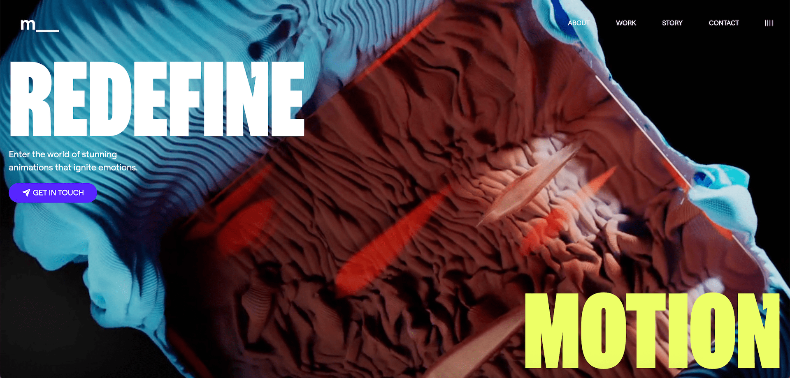

# Mythology Studio Landing Page version 2.0

This is an updated version of a landing page design & code practice project that I did a while back. [Version 1.0](https://github.com/jaymiyam/mythology-studio-landing-page) was created mainly for the purpose of practicing design and using GSAP. This version 2.0 is more complex and utilizes a new set of tools.

---

## Screenshot

---

## 🛠️ Tech Stack

- **React** + **Vite**
- **GSAP** for advanced animations
- **TailwinsCSS** for styling
- **Iconify** for icons
